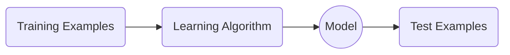

# Machine learning basics


---


## What is learning?


Machine Learning is about predicting the future based on the past.


(Book: [CIML](https://ciml.info/))


```{figure} ../_static/imgs/ml_basics/ml.PNG
:width: 80%
:alt: what is machine learning.

Machine learning.
```


---

## Machine Learning Paradigm

<br>
<br>
<br>
<br>




```{figure} ../_static/imgs/ml_basics/ml_paradigm.PNG
:width: 80%
:alt: machine learning paradigm.

Machine learning paradigm.
```


---

## Formulation of learning

<br>
<br>


$$
\mathop{\mathbb{E}}_{(\mathbf{x}, y) \sim \mathcal{D}} [L(y, f(\mathbf{x}))]
$$

<br>
<br>


```{figure} ../_static/imgs/ml_basics/formulation.PNG
:width: 80%
:alt: formulation of learning.

Formulation of learning.
```


In practice, we use:

$$
\frac{1}{N} \sum_{i=1}^{N} L(y_i, f(\mathbf{x}_i))
$$


```{figure} ../_static/imgs/ml_basics/formulation_practice.PNG
:width: 80%
:alt: formulation of learning in practice.

Formulation of learning in practice.
```


---

## Interactive demo (TensorFlow Playground: [link](https://playground.tensorflow.org/))

<iframe src="https://playground.tensorflow.org/" width="100%" height="500px"></iframe>


---

## Supervised learning


```{figure} ../_static/imgs/ml_basics/supervised.PNG
:width: 80%
:alt: supervised learning.

Supervised learning.
```


---

### Classification


```{figure} ../_static/imgs/ml_basics/classification.PNG
:width: 80%
:alt: classification.

Classification.
```


```{figure} ../_static/imgs/ml_basics/classification2.PNG
:width: 80%
:alt: classification2.

Classification.
```


```{figure} ../_static/imgs/ml_basics/classification3.PNG
:width: 80%
:alt: classification3.

Classification.
```


---

### Regression


```{figure} ../_static/imgs/ml_basics/regression.PNG
:width: 80%
:alt: regression.

Regression.
```

What ist the difference between classification and regression?


```{figure} ../_static/imgs/ml_basics/regression_vs_classification.PNG
:width: 80%
:alt: regression vs classification.

Regression vs Classification.
```

Classification is a more well-defined and well-studied problem than regression. Try to use classification when you can.


---

## Unsupervised learning


```{figure} ../_static/imgs/ml_basics/unsupervised.PNG
:width: 80%
:alt: unsupervised learning.

Unsupervised learning.
```


---

### Clustering


```{figure} ../_static/imgs/ml_basics/clustering.PNG
:width: 80%
:alt: clustering.

Clustering using K-means.
```


---

### Dimensionality reduction


```{figure} ../_static/imgs/ml_basics/dimension_reduction.PNG
:width: 80%
:alt: dimensionality reduction.

Dimensionality reduction.
```


---

## Models

What is a model for machine learning?


```{figure} ../_static/imgs/ml_basics/model.PNG
:width: 80%
:alt: model.

Model.
```


---

### Nearest neighbor


```{figure} ../_static/imgs/ml_basics/nearestneighbor.PNG
:width: 80%
:alt: nearest neighbor.

Nearest neighbor.
```


---

### Linear models


```{figure} ../_static/imgs/ml_basics/linear.PNG
:width: 80%
:alt: linear models.

Linear models.
```


```{figure} ../_static/imgs/ml_basics/linear2.PNG
:width: 80%
:alt: linear models.

Linear models.
```


---

### Decision trees


```{figure} ../_static/imgs/ml_basics/decision_trees.PNG
:width: 80%
:alt: decision trees.

Decision trees.
```


---

### Neural networks

Where all the magic happens.

For this class, we will focus mainly on neural networks.

We will talk more in the DL part of the Basics.

---

## Evaluation

This is one of the most important parts of a machine learning pipeline. 

It tells you how good your model will perform *in the future*.

---

### Train/val/test splits


```{figure} ../_static/imgs/ml_basics/splits.PNG
:width: 80%
:alt: train/val/test splits.

Train/val/test splits.
```


```{figure} ../_static/imgs/ml_basics/splits2.PNG
:width: 80%
:alt: train/val/test splits2.

Train/val/test splits.
```


---

### Cross-validation


```{figure} ../_static/imgs/ml_basics/cross-validation.PNG
:width: 80%
:alt: cross-validation.

Cross-validation.
```


```{figure} ../_static/imgs/ml_basics/cross-validation2.PNG
:width: 80%
:alt: cross-validation2.

Cross-validation.
```


---

### Metrics


```{figure} ../_static/imgs/ml_basics/metric.PNG
:width: 80%
:alt: metric.

Metric.
```


---

### Overfitting


```{figure} ../_static/imgs/ml_basics/overfitting.PNG
:width: 80%
:alt: overfitting.

Overfitting.
```


---
