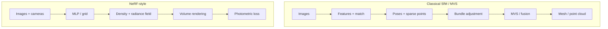

## 3D reconstruction

### Motivation

**3D reconstruction** asks: given **images** of a scene (and usually **camera parameters**), recover a **3D representation**—points, a surface mesh, or an **implicit** function—that explains what we see. Unlike single-view depth, **multiple viewpoints** provide **parallax**: the same surface point projects to different pixels in different images, which is the geometric signal for triangulation and consistency checks.

Why it matters:

- **Cultural heritage and mapping** digitize buildings and terrain at scale.
- **Robotics and autonomous systems** build maps and localize against them.
- **Graphics and VFX** need camera-registered geometry for relighting and editing.
- **AR** anchors virtual content to real geometry.

Intuition: **classical** pipelines (feature matching + geometry optimization) are interpretable and still widely used; **learning-based** methods (NeRF and follow-ups) bake appearance and geometry into a neural field and supervise mostly with **photometric** loss across views, trading interpretability for flexibility on complex appearance.

---

### Task definition

| Input (typical) | Output (typical) | What is “supervised” |
|-----------------|------------------|----------------------|
| Calibrated multi-view RGB | Sparse or dense point cloud, mesh | Geometric consistency + optional laser-scan GT |
| Calibrated multi-view RGB | **Novel views** + implicit geometry | **Re-rendering loss** (colors must match real images) |
| Video / unordered photo set | Cameras + sparse model | Same, after **SfM** supplies poses |

**Explicit vs implicit geometry.**

- **Explicit**: point cloud, triangle mesh, depth maps per view—easy to measure, edit, and simulate physics on.
- **Implicit**: neural field $(\mathbf{x}) \mapsto$ density + color (NeRF-style)—compact and smooth, but extracting a mesh needs **marching cubes** on a sampled grid.

**Static vs dynamic.** Classical SfM and vanilla NeRF assume a **rigid world** (or a single time instant). Dynamic scenes need extensions (4D fields, per-frame deformations) not covered here.

---

### Main ideas

**1. Multi-view constraints.** For two calibrated cameras, a 3D point $\mathbf{X}$ projects to $\mathbf{x}_1, \mathbf{x}_2$ that satisfy the **epipolar constraint** $\mathbf{x}_2^\top \mathbf{F} \mathbf{x}_1 = 0$ with fundamental matrix $\mathbf{F}$ (or essential matrix $\mathbf{E}$ in normalized coordinates). Matching features **along epipolar lines** reduces search from 2D to 1D.

**2. Triangulation.** Given two or more projection matrices $\mathbf{P}_i$ and corresponding points $\mathbf{x}_i$, solve for $\mathbf{X}$ that minimizes reprojection error (linear triangulation + nonlinear refinement).

**3. Bundle adjustment (BA).** Jointly refine **camera parameters** (and sometimes sparse 3D points) by minimizing **sum of squared reprojection errors** across all observations—nonlinear least squares, usually with sparse structure.

**4. Dense reconstruction.** **Multi-view stereo (MVS)** propagates correspondence confidence to a dense depth or voxel labeling per view, then fuses into a surface. **NeRF** instead learns a **volume** whose **rendered** images match all inputs.

```{figure} https://upload.wikimedia.org/wikipedia/commons/1/14/Epipolar_geometry.svg
:width: 72%
:alt: Two cameras, epipolar plane, and epipolar lines

**Epipolar geometry:** a 3D point and the two camera centers define a **plane** that cuts each image along **epipolar lines**; a match in one image must lie on the corresponding line in the other. That is the backbone constraint for matching and triangulation in classical SfM. *Image: Arne Nordmann (norro), [CC BY-SA 3.0](https://creativecommons.org/licenses/by-sa/3.0/deed.en), Wikimedia Commons.*
```



**Mistake to avoid:** feeding NeRF **wrong or inconsistent intrinsics/extrinsics**. Garbage poses produce blurry or duplicated geometry; always run a robust **SfM** (e.g., COLMAP) or use ground-truth calibration from synthetic data.

---

### Classical pipeline and COLMAP

**Rough pipeline** (many variants):

1. **Features**: detect SIFT / SuperPoint keypoints, compute descriptors.
2. **Matching**: nearest-neighbor + ratio test; for video, temporal neighbors first.
3. **Two-view geometry**: estimate $\mathbf{E}$ or $\mathbf{F}$, recover pose; reject outliers (RANSAC).
4. **Incremental SfM**: add cameras one by one; **triangulate** new points; **bundle-adjust** the growing model.
5. **Dense step (optional)**: patch-based or learning-based MVS, then **TSDF fusion** or Poisson surface reconstruction.

**[COLMAP](https://colmap.github.io/)** is an open-source system that implements **incremental SfM** and **MVS** with a usable CLI and GUI. Typical workflow for students:

- Prepare images (overlap, sharp, **baseline**—not too wide, not too narrow).
- Run **feature extraction** and **exhaustive** or **sequential** matching.
- Run **mapper** to obtain **sparse** reconstruction (cameras + points).
- Optionally run **patch match stereo** and **fusion** for dense geometry.

Practical tips:

- **Textureless** walls and **reflective** glass break feature matching; add cross-view overlap.
- **Scale** from SfM is arbitrary up to similarity unless you fix distance with a known object size or GPS/IMU.

---

### NeRF (Neural Radiance Fields)

**Idea.** Represent the scene by a function, usually an **MLP** (often with **positional encoding** of $\mathbf{x}$ and viewing direction $\mathbf{d}$), that outputs **volume density** $\sigma(\mathbf{x})$ and **view-dependent color** $\mathbf{c}(\mathbf{x}, \mathbf{d})$. Along each camera ray $\mathbf{r}(t) = \mathbf{o} + t\mathbf{d}$, **alpha-composite** samples:

$$
\hat{C}(\mathbf{r}) = \sum_{k=1}^{K} T_k \left(1 - \exp(-\sigma_k \delta_k)\right) \mathbf{c}_k,
$$

where $T_k$ is accumulated transmittance up to sample $k$, and $\delta_k$ are segment lengths between samples along the ray. Train by minimizing **photometric error** between rendered $\hat{C}$ and observed pixel colors (often **L2** or **L1**), plus optional regularizers.

**What supervision buys you:** no direct 3D labels—**many views** of the same static scene provide **self-consistency**. The network finds a 3D-compatible explanation of all images.

**Limitations (vanilla NeRF):** slow training and rendering, preference for **static** scenes and **bounded** volumes, sensitivity to **camera noise**. Many extensions address speed (instant-ngp), unbounded scenes, dynamic objects, and anti-aliasing—treat those as reading topics.

```{figure} https://upload.wikimedia.org/wikipedia/commons/2/2a/Alpha_compositing.svg
:width: 78%
:alt: Alpha compositing: layering semi-transparent shapes

**Volume rendering along a ray** accumulates color and opacity sample by sample—the same **front-to-back compositing** idea as alpha blending: each segment contributes according to its opacity and what remains visible “behind” it. NeRF uses learned density to set those alphas. *Image: Wereon et al. (vectorization), public domain, Wikimedia Commons.*
```

---

### Training and evaluation

**Classical / COLMAP.** “Training” is nonlinear optimization (BA). Evaluate **reconstruction quality** with **geometric** metrics against laser scans if available: **Chamfer distance**, **F-score** at a distance threshold, or **accuracy/completeness** curves.

**NeRF / novel-view synthesis.** Report **PSNR / SSIM / LIPS** on **held-out** camera views from the same scene. Geometry is often assessed **after mesh extraction** (same Chamfer/F-score) or by **depth** from expected ray termination.

| What you measure | Typical metric | Notes |
|------------------|----------------|-------|
| Point / mesh vs GT | Chamfer, F-score | Align predictions to GT (similarity transform) if scale is ambiguous |
| Image synthesis | PSNR, SSIM, LPIPS | Higher PSNR = closer pixels on held-out views |
| Runtime | sec / frame | Important for interactive use |

---

### Math formulation summary

**Reprojection error** for observed image point $\mathbf{x}_{ij}$ (view $i$, point $j$):

$$
e_{ij} = \big\| \mathbf{x}_{ij} - \pi\big(\mathbf{P}_i, \mathbf{X}_j\big) \big\|^2,
$$

where $\pi$ is the pinhole projection. **Bundle adjustment** minimizes $\sum_{i,j} e_{ij}$ (often with robust kernels on outliers).

**NeRF objective** on a set of rays $\mathcal{R}$ sampled from training images:

$$
\mathcal{L} = \frac{1}{|\mathcal{R}|} \sum_{\mathbf{r}\in\mathcal{R}}
\big\| \hat{C}(\mathbf{r}) - C(\mathbf{r}) \big\|^2,
$$

with optional **total variation** or **distortion** regularizers in practice.

---

### Starter sketch (volume rendering step)

The snippet below shows only **one ray** composited from sorted samples (NeRF training loops wrap this in batched ray sampling and backward through the MLP).

```python
import torch


def render_ray_sigma_color(sigmas: torch.Tensor, colors: torch.Tensor, deltas: torch.Tensor) -> torch.Tensor:
    """
    sigmas: (K,) non-negative density * segment length scale
    colors: (K, 3) RGB along the ray
    deltas: (K,) segment lengths along the ray
    Returns rendered RGB (3,).
    """
    # alpha_k = 1 - exp(-sigma_k * delta_k); NeRF often predicts sigma, then alpha = 1 - exp(-sigma * delta)
    alpha = 1.0 - torch.exp(-sigmas * deltas)
    transmittance = torch.cumprod(
        torch.cat(
            [torch.ones(1, device=sigmas.device, dtype=sigmas.dtype), 1.0 - alpha + 1e-10]
        ),
        dim=0,
    )[:-1]
    weights = transmittance * alpha
    return (weights[:, None] * colors).sum(dim=0)
```

Suggested student exercises:

1. Run COLMAP on a **20–40 image** orbit of a textured object; visualize sparse points and camera frusta.
2. Plot **reprojection error** histogram before vs after bundle adjustment (COLMAP reports).
3. Implement **random ray batching** from one training image and overfit a tiny NeRF on a **single** synthetic scene (blender data) to verify rendering matches the equation above.
4. Compare **explicit mesh** from COLMAP+MVS to **mesh extracted** from a trained NeRF on the same scene (alignment and Chamfer if GT exists).
