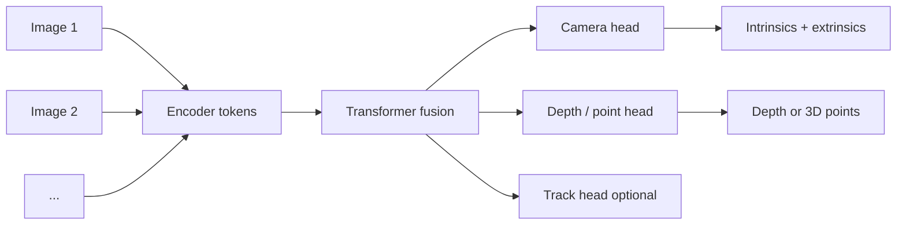

## End-to-end geometry models

### Motivation

Classical 3D vision stacks **separate stages**: detect and match features, estimate two-view geometry, run **incremental SfM** and **bundle adjustment**, then optionally **MVS** or **NeRF** optimization. Each stage has its own failure modes (textureless regions, outliers) and tuning knobs. **End-to-end geometry models** ask a different question: can one **neural network**, in a **single forward pass**, map a **set of images** directly to **cameras and dense 3D quantities**—without alternating nonlinear solvers at inference?

Why that is attractive:

- **Speed**: feed-forward inference can run in **sub-second** time on many views, versus minutes of CPU/GPU for BA-heavy pipelines.
- **Simplicity**: one checkpoint and one training recipe instead of a fragile toolchain.
- **Learning priors**: large models trained on diverse scenes can **hallucinate plausible** structure where classical matching is ambiguous—at the cost of trusting the training distribution.

Intuition: instead of hand-designed pipelines that **explicitly** enforce multi-view consistency through reprojection minimization, the network is **trained** so that its outputs are consistent with **supervised 3D signals** (and often with **photometric** or **geometric** losses). At test time, **consistency is implicit** in what the model learned.

```{figure} https://upload.wikimedia.org/wikipedia/commons/9/94/Projection_geometry.svg
:width: 48%
:alt: Two quadrilaterals related by a perspectivity through a projection center

**Many images, one scene:** each photograph is a **projective** observation of 3D geometry. Classical pipelines make that relationship explicit (poses, BA, MVS); end-to-end models learn a function from **sets of images** to **cameras + dense geometry** so this structure is handled **implicitly** inside the network. *Image: Krishnavedala, [CC0](https://creativecommons.org/publicdomain/zero/1.0/), Wikimedia Commons.*
```

---

### Main idea

**End-to-end** here means: **one model** $f_\theta$ takes **one or many RGB images** (and optionally their rough order or IDs) and produces **several geometric outputs together**, for example:

- **Intrinsics and extrinsics** (per frame)
- **Per-pixel depth** or **3D point maps** in a common frame
- **Point tracks** or correspondences across views

The architectural pattern is usually:

1. **Image encoder** — turn each image into a sequence of tokens (often a **ViT** or **DINO**-style backbone).
2. **Reasoning backbone** — **self-attention** across **space and time** (within frames and across frames) so that the model can fuse evidence from all views before committing to depth and poses.
3. **Task heads** — small decoders that map fused tokens to **camera parameters**, **dense maps**, or **track features**.

```{figure} https://upload.wikimedia.org/wikipedia/commons/3/34/Transformer%2C_full_architecture.png
:width: 58%
:alt: Transformer encoder-decoder with multi-head attention blocks

**Shared pattern:** encoder blocks with **self-attention** build contextual token representations; **task-specific heads** (not shown in this generic diagram) turn those tokens into **poses**, **depth**, or **tracks**. Geometry-focused models reuse this blueprint with image **patch** or **DINO** tokens and **cross-view** attention. *Image: dvgodoy / Cosmia Nebula, [CC BY 4.0](https://creativecommons.org/licenses/by/4.0/deed.en), Wikimedia Commons.*
```



**Contrast with the rest of this chapter.**

| Approach | Inference | Typical strengths | Typical weaknesses |
|----------|-----------|-------------------|---------------------|
| **Classical SfM + MVS** | Iterative optimization | Interpretable, metric when calibrated | Slow; brittle on weak texture |
| **NeRF / radiance fields** | Many steps / ray marching | High-quality view synthesis | Heavy training per scene |
| **End-to-end feed-forward** | Single forward pass | Fast joint prediction of geometry | Needs data; can generalize badly off-distribution |

**Mistake to avoid:** treating a feed-forward depth or pose map as **metrically calibrated truth** without checking **scale** and **drift** on your domain. These models are **learned estimators**, not guaranteed projective-geometry solvers.

---

### VGGT as a concrete example (main idea only)

**VGGT** (Visual Geometry Grounded Transformer, CVPR 2025) is representative of this line of work: a **large transformer** that, from **variable-length** image sets, jointly predicts **cameras**, **depth**, **point maps**, and **3D point tracks** in **one pass**. The emphasis is on **shared representation learning**: the same fused tokens support **multiple geometric tasks**, rather than training a separate network per output.

Conceptually important points (not an architecture spec):

- **Geometry as supervised prediction**: the model is trained so that its outputs align with **ground-truth 3D annotations** and/or strong **proxy losses** at scale; **global attention** lets later layers reconcile **all views** before predicting cameras and dense maps.
- **Minimal hand-engineered pipeline**: there is no separate COLMAP stage at inference; the network **replaces** much of that stack for **prediction**, not for certifiable metrology.

For implementation details, benchmarks, and ablations, read the [VGGT paper](https://arxiv.org/abs/2503.11651) and project page ([vgg-t.github.io](https://vgg-t.github.io/)). For coursework, treat VGGT as evidence that **joint training** of cameras and dense geometry under large supervision is a **practical alternative** to classical pipelines for **interactive** applications—not as a drop-in replacement for **survey-grade** reconstruction without domain validation.

---

### Training and evaluation (at a glance)

**Training** usually combines:

- **Supervision** on **depth**, **poses**, **intrinsics**, and/or **3D points** from synthetic engines, RGB-D captures, or reconstructed datasets.
- Sometimes **multi-view photometric** or **reprojection** terms so predictions stay **consistent** with images.

**Evaluation** reuses familiar metrics: **camera pose error** (rotation/translation), **depth** metrics (Abs Rel, $\delta_1$), **point cloud** Chamfer / F-score, and **tracking** accuracy—always **comparing fairly** (same alignment conventions as in `single_depth.md` and `3d_reconstruction.md`).

---

### Takeaway

End-to-end geometry models **trade explicit geometric optimization for learned inference**: one forward pass, **joint** outputs, strong results when **training coverage** matches **deployment**. The **main idea** is unified **token-based reasoning** over images, not any single headline architecture—**VGGT** is one prominent instance of that idea at scale.
