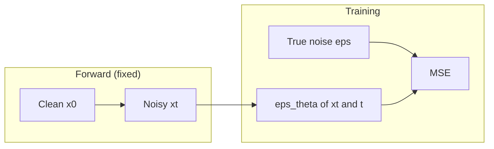
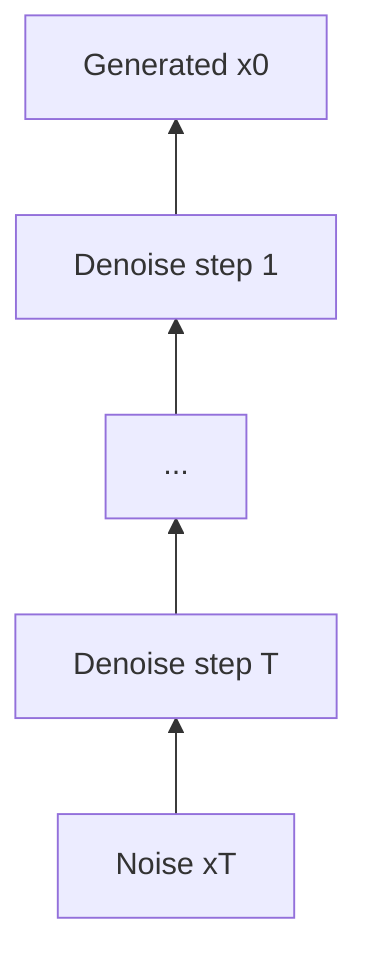

## Diffusion models for image generation

### Motivation

**Diffusion models** learn to generate images by **gradually denoising** random Gaussian noise. Unlike a **VAE**, which maps an image to a **single** low-dimensional code in one shot (Chapter 6, `vae.md`), diffusion keeps the state **full-dimensional** (same size as the image) and uses a **long Markov chain** of small denoising steps. That design trades **sampling speed** (many forward passes at inference) for **flexible likelihood modeling** and, in practice, **very high sample quality**.

Why it matters:

- **State of the art** on many image and video generation benchmarks when combined with large data and compute.
- **Stable training** compared to adversarial (GAN) training: the objective is close to **weighted denoising MSE**, with less mode-collapse folklore.
- **Composable extensions**: **latent diffusion** (operate in a compressed VAE latent for speed), **classifier-free guidance** (trade diversity for prompt alignment), **inpainting** and **editing** by fixing parts of the noisy state across steps.

Intuition: imagine dropping ink in water (**physical diffusion**): concentration **smooths out** until the tank looks uniform. **Forward diffusion** in ML is the same idea—**destroy** structure by adding noise step by step until the image is indistinguishable from **pure noise**. A neural net is trained to **run the movie backward**: given a slightly noisy image and the time index, **predict** what noise was added (or predict the clean image), then **remove** a little noise. Repeat hundreds of times—you land on a plausible new image.

---

#### Diffusion in physics

In physics and applied math, **diffusion** describes how mass, heat, or concentration **spreads** under random microscopic motion (Brownian motion of particles). A classic idealization is **Fick’s laws**: flux goes from high to low concentration; the concentration field obeys a **heat equation** (parabolic PDE), which **smooths** sharp features over time.

```{figure} https://upload.wikimedia.org/wikipedia/commons/2/28/1D_random_walk_2500steps.svg
:width: 88%
:alt: One-dimensional random walk path over many steps

**Random walk intuition:** each step adds independent random displacement; the position after many steps is approximately **Gaussian** (central limit theorem). **Forward diffusion** in generative modeling is analogous: repeatedly add small Gaussian noise so the signal “wanders” toward a **simple** high-dimensional Gaussian. *Image: László Németh, [CC BY-SA 4.0](https://creativecommons.org/licenses/by-sa/4.0/deed.en), Wikimedia Commons.*
```

You do **not** need the PDE on exams for this course; keep only the picture: **many small random perturbations** erase detail and produce a **known** simple distribution at the end.

---

#### Diffusion process in image generation

For images, **forward diffusion** defines a sequence

$$
\mathbf{x}_0 \rightarrow \mathbf{x}_1 \rightarrow \cdots \rightarrow \mathbf{x}_T,
$$

where $\mathbf{x}_0$ is a **real** image from data and $\mathbf{x}_T$ is **almost pure** isotropic Gaussian noise. Each step adds a little noise (variance schedule $\beta_1,\ldots,\beta_T$). The **reverse** process is unknown; we approximate it with a network that **denoises** one step at a time. **Generation** starts from $\mathbf{x}_T \sim \mathcal{N}(\mathbf{0}, \mathbf{I})$ and runs the learned reverse updates.

**Contrast with VAE in one sentence:** a VAE compresses to a **short** vector $\mathbf{z}$ and decodes in **one** step; diffusion **does not** compress the state during the chain—the **trajectory** is the representation of “how this image could emerge from noise.”

---

### Main idea

**Denoising diffusion probabilistic models (DDPM)** use two processes:

| Process | Direction | What is fixed | What is learned |
|---------|-----------|-----------------|-----------------|
| **Forward** | data $\rightarrow$ noise | Noise schedule $\beta_t$ (hyperparameters) | Nothing (closed form) |
| **Reverse** | noise $\rightarrow$ data | Same schedule (used in sampling formulas) | Network $\boldsymbol{\epsilon}_\theta(\mathbf{x}_t, t)$ or $\mathbf{x}_0$-predictor |

**Step-by-step intuition (forward).** Fix a training image $\mathbf{x}_0$.

1. Pick a random time $t \in \{1,\ldots,T\}$.
2. Sample **one-step** noise: conceptually $\mathbf{x}_t$ is obtained from $\mathbf{x}_{t-1}$ by adding Gaussian noise with variance $\beta_t$.
3. Thanks to **Gaussian reparameterization**, you can **jump** from $\mathbf{x}_0$ to any $\mathbf{x}_t$ in one draw without simulating all intermediate steps:

$$
q(\mathbf{x}_t \,|\, \mathbf{x}_0) = \mathcal{N}\big(\sqrt{\bar{\alpha}_t}\,\mathbf{x}_0,\; (1-\bar{\alpha}_t)\mathbf{I}\big),
$$

where $\alpha_t = 1-\beta_t$ and $\bar{\alpha}_t = \prod_{s=1}^{t}\alpha_s$. As $t$ grows, $\bar{\alpha}_t \to 0$ and $(1-\bar{\alpha}_t)\to 1$, so $\mathbf{x}_t$ looks like **standard noise**.

**Step-by-step intuition (training).** The network is taught **denoising**:

1. Sample image $\mathbf{x}_0$, time $t$, Gaussian noise $\boldsymbol{\epsilon}$.
2. Construct $\mathbf{x}_t = \sqrt{\bar{\alpha}_t}\,\mathbf{x}_0 + \sqrt{1-\bar{\alpha}_t}\,\boldsymbol{\epsilon}$.
3. Minimize **MSE** between the true $\boldsymbol{\epsilon}$ and $\boldsymbol{\epsilon}_\theta(\mathbf{x}_t, t)$ (or an equivalent parameterization predicting $\mathbf{x}_0$ or $\mathbf{x}_{t-1}$).

**Step-by-step intuition (generation).**

1. Sample $\mathbf{x}_T \sim \mathcal{N}(\mathbf{0}, \mathbf{I})$.
2. For $t = T, T-1, \ldots, 1$: run the network, **subtract** the predicted noise (with coefficients from the schedule), add a small amount of **Langevin**-style Gaussian noise (except often at $t=1$) to match the **reverse** Markov kernel used in DDPM.
3. Output $\mathbf{x}_0$ (clip to valid pixel range if needed).

**Concrete example (numbers).** Suppose $T=1000$, $\beta_t$ is small (e.g. linear from $10^{-4}$ to $0.02$). For a fixed MNIST digit $\mathbf{x}_0$, at $t=200$ the signal might still “look like a smeared digit”; at $t=800$ you mostly see **snow**; at $t=1000$ the marginal is **nearly** $\mathcal{N}(\mathbf{0},\mathbf{I})$. The network sees $(\mathbf{x}_t, t)$ and learns: “at this noise level, this blob is **usually** digit strokes plus this pattern of residual noise.”

**Mistake to avoid:** treating **training** as if you must loop $t=1\ldots T$ for every minibatch. You only need **one random $t$** per image and **one** noisy $\mathbf{x}_t$ via the closed-form formula above—otherwise training is unnecessarily slow.





---

### Training

**Variance schedule.** Choose $\beta_t \in (0,1)$ (linear, cosine, or learned). Define $\alpha_t = 1-\beta_t$, $\bar{\alpha}_t = \prod_{s=1}^{t}\alpha_s$. Precompute $\sqrt{\bar{\alpha}_t}$ and $\sqrt{1-\bar{\alpha}_t}$ for all $t$ as buffers.

**Noise-prediction objective (DDPM).** For each training example:

1. $\mathbf{x}_0 \sim p_{\mathrm{data}}$, $t \sim \mathrm{Uniform}(\{1,\ldots,T\})$, $\boldsymbol{\epsilon}\sim\mathcal{N}(\mathbf{0},\mathbf{I})$.
2. $\mathbf{x}_t = \sqrt{\bar{\alpha}_t}\,\mathbf{x}_0 + \sqrt{1-\bar{\alpha}_t}\,\boldsymbol{\epsilon}$.
3. **Loss:** $\mathcal{L} = \big\|\boldsymbol{\epsilon} - \boldsymbol{\epsilon}_\theta(\mathbf{x}_t, t)\big\|^2$ (often **mean** over pixels and batch).

**Architecture.** $\boldsymbol{\epsilon}_\theta$ is almost always a **U-Net**-style network: same spatial resolution as $\mathbf{x}_t$, with **time $t$** injected via **sinusoidal positional embeddings** or AdaGN layers (same spirit as NeRF’s positional encoding: tell the net “how noisy” the input is). Skip connections preserve edges, which helps predict high-frequency noise.

**Why predict noise?** Any reparameterization (predict $\mathbf{x}_0$, predict $\mathbf{x}_{t-1}$, predict noise) can be equivalent up to closed-form algebra; **$\boldsymbol{\epsilon}$-prediction** is numerically convenient and standard in codebases.

**Practical tips:**

- **Normalize inputs** to roughly $[-1,1]$ or standardize consistently with your noise scale.
- **EMA** (exponential moving average) of weights often improves sample quality.
- **Mixed precision** and gradient clipping are common at large resolutions.

---

### Generation

**Standard DDPM sampler** (conceptual; coefficients depend on whether you parameterize $\boldsymbol{\epsilon}$, $\mathbf{x}_0$, or $\mu$ of reverse Gaussian—always copy from a vetted implementation):

1. $\mathbf{x}_T \sim \mathcal{N}(\mathbf{0}, \mathbf{I})$.
2. For $t = T$ down to $1$: compute $\hat{\boldsymbol{\epsilon}} = \boldsymbol{\epsilon}_\theta(\mathbf{x}_t, t)$, then update $\mathbf{x}_{t-1}$ using the **closed-form reverse mean** plus optional Gaussian noise scaled by $\tilde{\beta}_t$ (DDPM) or set noise to **zero** for a deterministic variant (**DDIM**).

**Speed vs quality.** Full DDPM may use **hundreds** of steps. **DDIM**, distillation, and **consistency models** reduce steps at the cost of extra training or engineering; **latent diffusion** (e.g. Stable Diffusion) runs the chain in a **low-dimensional VAE latent** so each step is cheaper.

**Guidance (reading).** **Classifier-free guidance** trains the model **with and without** conditioning (e.g. text dropped randomly); at sampling time you blend conditional and unconditional predictions to push samples toward the prompt—stronger guidance can reduce diversity.

---

### Math formulation summary

**Forward kernel (single step):**

$$
q(\mathbf{x}_t \,|\, \mathbf{x}_{t-1}) = \mathcal{N}\big(\sqrt{1-\beta_t}\,\mathbf{x}_{t-1},\; \beta_t \mathbf{I}\big).
$$

**Marginal at time $t$ given $\mathbf{x}_0$:**

$$
q(\mathbf{x}_t \,|\, \mathbf{x}_0) = \mathcal{N}\big(\sqrt{\bar{\alpha}_t}\,\mathbf{x}_0,\; (1-\bar{\alpha}_t)\mathbf{I}\big),\quad
\bar{\alpha}_t = \prod_{s=1}^{t}(1-\beta_s).
$$

**Training loss (simplified):**

$$
\mathcal{L}_{\mathrm{simple}}(\theta)
=
\mathbb{E}_{t,\,\mathbf{x}_0,\,\boldsymbol{\epsilon}}\Big[
\big\|\boldsymbol{\epsilon} - \boldsymbol{\epsilon}_\theta(\mathbf{x}_t, t)\big\|^2
\Big],\quad
\mathbf{x}_t = \sqrt{\bar{\alpha}_t}\,\mathbf{x}_0 + \sqrt{1-\bar{\alpha}_t}\,\boldsymbol{\epsilon}.
$$

The full DDPM **variational bound** includes additional **coefficient** weighting; in practice the **unweighted** MSE above (“simple” objective) is often used and still works well.

---

### Starter sketch (training step)

This shows only the **stochastic reconstruction** of $\mathbf{x}_t$ and the **MSE** to $\boldsymbol{\epsilon}$. A full repo adds the U-Net, sampler, EMA, and data pipeline.

```python
import torch


def q_sample(x0: torch.Tensor, t: torch.Tensor, alphabar: torch.Tensor, eps: torch.Tensor) -> torch.Tensor:
    """x0: (B,C,H,W); t: (B,) int64; alphabar: (T,) with alphabar[t] = prod_{s<=t} (1-beta_s)."""
    # gather per-batch sqrt(alphabar_t) and sqrt(1-alphabar_t), shape (B,1,1,1)
    a = alphabar[t].view(-1, 1, 1, 1)
    sa = a.sqrt()
    s1ma = (1.0 - a).sqrt()
    return sa * x0 + s1ma * eps


def diffusion_training_loss(model, x0, betas, rng=None) -> torch.Tensor:
    b = x0.size(0)
    device = x0.device
    T = betas.shape[0]
    alphas = 1.0 - betas
    alphabar = torch.cumprod(alphas, dim=0)
    t = torch.randint(0, T, (b,), device=device, generator=rng)
    eps = torch.randn_like(x0, generator=rng)
    xt = q_sample(x0, t, alphabar, eps)
    eps_hat = model(xt, t)
    return torch.nn.functional.mse_loss(eps_hat, eps)
```

Suggested student exercises:

1. Implement **linear $\beta_t$ schedule** and plot $\sqrt{\bar{\alpha}_t}$ and $\sqrt{1-\bar{\alpha}_t}$ vs $t$; verify $\mathbf{x}_t$ marginal variance is near 1 for large $t$ when $\bar{\alpha}_t\approx 0$.
2. Train a tiny U-Net on **CIFAR-10** or **MNIST** at $32\times 32$ with $T=300$; log MSE and save samples every few epochs.
3. Compare **10-step DDIM** vs **100-step DDPM** samples from a public checkpoint (same seed) and comment on sharpness vs artifacts.
4. **Ablation:** predict $\mathbf{x}_0$ instead of $\boldsymbol{\epsilon}$ (convert targets with algebra) and report whether training is stabler or slower.

---

### Useful resources

- Ho, Jain, Abbeel, **Denoising Diffusion Probabilistic Models**, NeurIPS 2020: [arXiv:2006.11239](https://arxiv.org/abs/2006.11239) (core DDPM training and sampling).
- Song, Sohl-Dickstein, Kingma, Kumar, Ermon, Poole, **Score-Based Generative Modeling through SDEs**, ICLR 2021: [arXiv:2011.13456](https://arxiv.org/abs/2011.13456) (continuous-time view linking diffusion and score matching).
- Rombach, Blattmann, Lorenz, Esser, Ommer, **High-Resolution Image Synthesis with Latent Diffusion Models**, CVPR 2022: [arXiv:2112.10752](https://arxiv.org/abs/2112.10752) (Stable Diffusion-style latent diffusion).
- Song, Meng, Ermon, **Denoising Diffusion Implicit Models**, ICLR 2021: [arXiv:2010.02502](https://arxiv.org/abs/2010.02502) (faster sampling).
- Lilian Weng, **What are diffusion models?** (blog): [https://lilianweng.github.io/posts/2021-07-11-diffusion-models/](https://lilianweng.github.io/posts/2021-07-11-diffusion-models/) (pedagogical diagrams and variants).
