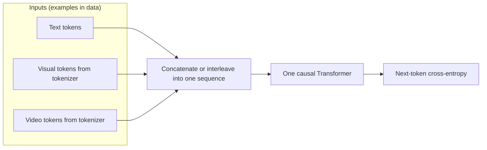
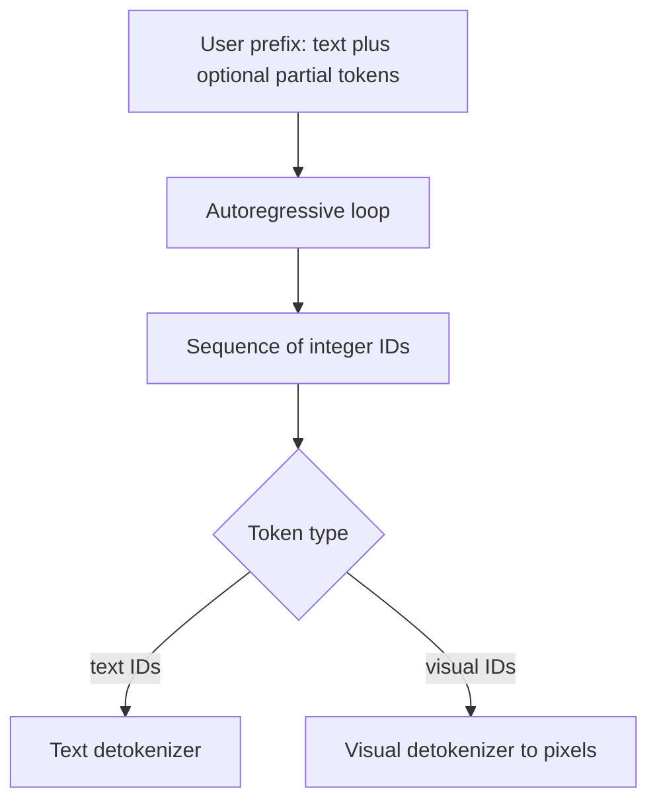

## Token-based generation (unified autoregression)

### Motivation

Many systems you use every day are **language models**: they read a **sequence of discrete tokens** and learn to predict the **next** token. A natural question is whether **images and video** can be handled the **same way**—not as a separate diffusion pipeline or a VAE latent, but as **more tokens** in one vocabulary, trained with the **same** cross-entropy objective.

**Emu3** ([Wang *et al.*, arXiv:2409.18869](https://arxiv.org/abs/2409.18869)) pushes this idea to a multimodal extreme: **images, text, and video** are all turned into **discrete indices**; a **single causal Transformer** is trained **from scratch** only on **next-token prediction** over **mixed** multimodal sequences. The paper argues this **simplifies** the stack (no separate diffusion sampler, no CLIP+LLM composition in their comparison story) while remaining competitive on both **generation** and **perception** tasks in their reported benchmarks.

Why it matters for students:

- **One training recipe:** softmax + cross-entropy at every supervised position—the same lesson as GPT-style LMs, extended beyond ASCII.
- **Scaling story:** data, parameters, and context length compound in a familiar way; the design space is “tokens + Transformer,” which is easy to reason about.
- **Contrast with the rest of Chapter 6:** VAEs (`vae.md`) fit a **continuous** latent and a decoder likelihood; diffusion (`diffusion.md`) iterates on **full-resolution continuous** noise. Emu3-style models iterate on a **discrete** sequence with **autoregression**—different math, different failure modes, different speed trade-offs.

Intuition: imagine a single long tape that might read *text token, text token, …, image token, image token, …, video token, …*. The model never switches “modes” in the loss—it only ever answers: **given everything to the left on the tape, what is the distribution of the next symbol?**

```{figure} https://upload.wikimedia.org/wikipedia/commons/9/96/Transformer%2C_full_architecture.png
:width: 72%
:alt: Transformer architecture diagram with encoder and decoder stacks

**Shared backbone:** a decoder-only (GPT-style) Transformer uses **causal self-attention**: position $i$ attends only to tokens $\lt i$. Multimodal AR models use the same block; modalities differ only by **which embedding table** and **which detokenizer** a token ID routes to. *Image: Cmglee, [CC BY-SA 4.0](https://creativecommons.org/licenses/by-sa/4.0/deed.en), Wikimedia Commons.*
```

---

### High-level idea: Emu3

**What Emu3 does (conceptual, not every engineering detail):**

1. **Tokenize each modality.** Text becomes subword IDs as usual. Images and video frames are passed through a **discrete visual tokenizer** (a learned encoder–codebook–decoder pipeline) so that each local patch of content becomes an **integer code** in a finite vocabulary—think “visual subwords.”
2. **Serialize into one sequence.** Training examples are **long token sequences** that can mix text, image codes, and video codes according to the task (e.g. caption + pixels, or interleaved streams). Order and formatting are part of the **protocol** the data curator chooses.
3. **Train one causal Transformer** to minimize **next-token cross-entropy** on the mixture—**no** diffusion noise schedule, **no** ELBO with KL to a Gaussian prior for generation (contrast `vae.md` and `diffusion.md`).
4. **Generate autoregressively.** At inference, you provide a **prefix** (prompt, partial image, etc.), then **sample or argmax** the next token repeatedly until you hit a stop condition, then **run the visual detokenizer** on the image/video token spans to obtain pixels.

**Autoregressive nature.** The joint probability of a token sequence $\mathbf{s}=(s_1,\ldots,s_L)$ is

$$
p_\theta(\mathbf{s}) = \prod_{i=1}^{L} p_\theta\big(s_i \,\big|\, s_1,\ldots,s_{i-1}\big).
$$

Each factor is a **categorical** distribution (softmax over vocabulary). **Sampling** is inherently **serial** along the generation order: token $i$ depends on all previous choices.

**Concrete student-sized example.** Suppose a prompt is 20 text tokens, followed by $64$ image tokens that stand for an $8\times 8$ grid of visual codes, then an end token. Training shows the model the **ground-truth** next token at each position; at test time the model **fills** positions $21,\ldots,84$ one by one from its own predictions. Video is the same idea with **more** tokens along time and space—still “predict next discrete symbol.”

**Mistake to avoid:** confusing **Emu3’s training objective** (plain next-token CE) with **diffusion’s** denoising regression or **VAE’s** ELBO. They can all generate images, but the **quantities being optimized** and the **sampling loops** are different objects; exam questions should keep them separate.





---

### How this differs from VAE and diffusion

| | **VAE** (`vae.md`) | **Diffusion** (`diffusion.md`) | **Emu3-style AR** |
|---|-------------------|-------------------------------|-------------------|
| **Core state** | Low-dim continuous $\mathbf{z}$ (plus decoder over pixels) | Full-resolution **continuous** noisy image $\mathbf{x}_t$ at each step | **Discrete token** sequence (mixed modalities) |
| **Training signal** | ELBO: reconstruction + KL to prior | Usually MSE on noise (or equivalent) in a forward noising process | **Cross-entropy** on next token only |
| **Generative “loop”** | Sample $\mathbf{z}\sim\mathcal{N}(\mathbf{0},\mathbf{I})$, **one** (or few) decoder forward(s) | $T$ **denoising** steps on a **continuous** grid | Up to $L$ **next-token** steps on a **discrete** vocabulary |
| **Likelihood** | Lower bound on $\log p(\mathbf{x})$ | Variational bound / score view (depending on formulation) | Product of softmax probabilities over tokens (in principle **exact** for the tokenized model) |
| **Modality unification** | Typically one domain per model | Often separate stacks for text vs image (e.g. latent diffusion + text encoder) | **Single** Transformer over **shared** token space |

**One sentence each:**

- **VAE:** learn a **compressed continuous code** and a decoder; generation is **one shot** from the prior over $\mathbf{z}$.
- **Diffusion:** learn to **undo Gaussian corruption** in many small **continuous** steps.
- **Emu3-style AR:** learn a **discrete sequence model**; generation is **one softmax at a time** along the sequence, across **any** modality represented as tokens.

---

### Tokenization (black-box level)

Courses rarely re-derive the full visual tokenizer. It is enough to know:

- **Pixels are not predicted token-by-token at RGB resolution** in these systems; instead, a **learned** tokenizer maps local patches to **code IDs** (a finite “visual vocabulary”), and the Transformer predicts those IDs.
- The **inverse** map (IDs → pixels) lives **outside** the Transformer, in the tokenizer’s decoder head.

That separation is what lets a **language-style** head (vocabulary-sized softmax) stand in for a **high-dimensional continuous** regression target at every step—which is what diffusion does at each noise level.

---

### Architecture and training (summary)

- **Decoder-only Transformer** with **causal masking** on the **entire** multimodal sequence.
- **Embeddings:** each token ID maps to a vector; **positional** information tells the model where it is in the long tape (including which modality segment it is in—often implied by position and special boundary tokens rather than a second network).
- **Training:** standard **teacher-forced** next-token loss on whichever positions are supervised (analogous to `captioning.md`; **exposure bias** between train and free-run generation remains a known issue).
- **Conditioning:** implemented as **prefix tokens** (e.g. “user:” text, then image tokens to fill)—no separate diffusion guidance network in the Emu3 story.

---

### Generation (summary)

1. Build initial **token IDs** for the prompt (text tokenizer + any fixed control tokens).
2. **Loop:** forward the model on the current sequence, read logits for the **last** position, sample the next ID, append, repeat until done.
3. **Slice** the spans that belong to images or video and pass them through the **visual detokenizer** to get RGB frames.

**Cost vs diffusion:** both are often **many** forward passes per output; diffusion steps are **continuous** updates; AR steps are **discrete** vocabulary decisions. Engineering (cache, speculative decoding, shorter visual token grids) determines wall-clock, not the high-level math.

---

### Math formulation summary

Over a mixed sequence $\mathbf{s}=(s_1,\ldots,s_L)$ with vocabulary size $V$,

$$
p_\theta(\mathbf{s}) = \prod_{i=1}^{L} \mathrm{softmax}\big(f_\theta(s_1,\ldots,s_{i-1})\big)_{s_i},
$$

with $f_\theta$ the Transformer logits. **Training** maximizes $\log p_\theta(\mathbf{s}^\star)$ on data (cross-entropy); **sampling** draws from the same conditionals in order.

---

### Starter sketch (causal LM step)

Same minimal pattern as a **text** GPT: logits for the next ID from all past IDs. Visual **vocab size** can be large (tens of thousands), so production models use width, depth, and sharding—not shown here.

```python
import torch
import torch.nn as nn
import torch.nn.functional as F


class TinyCausalLM(nn.Module):
    def __init__(self, vocab_size: int, dim: int = 256, depth: int = 4, heads: int = 4, max_len: int = 512):
        super().__init__()
        self.tok = nn.Embedding(vocab_size, dim)
        self.pos = nn.Embedding(max_len, dim)
        block = nn.TransformerEncoderLayer(
            d_model=dim, nhead=heads, dim_feedforward=4 * dim, batch_first=True, dropout=0.1
        )
        self.tr = nn.TransformerEncoder(block, num_layers=depth)
        self.head = nn.Linear(dim, vocab_size)
        self.register_buffer("causal_mask", torch.triu(torch.ones(max_len, max_len), diagonal=1).bool())

    def forward(self, token_ids: torch.Tensor) -> torch.Tensor:
        b, l = token_ids.shape
        pos = torch.arange(l, device=token_ids.device)
        h = self.tok(token_ids) + self.pos(pos)
        m = self.causal_mask[:l, :l]
        h = self.tr(h, mask=m)
        return self.head(h)


def next_token_ce(logits: torch.Tensor, targets: torch.Tensor) -> torch.Tensor:
    """logits (B,L,V), targets (B,L)."""
    return F.cross_entropy(logits[:, :-1].reshape(-1, logits.size(-1)), targets[:, 1:].reshape(-1))
```

Suggested student exercises:

1. Read the **Emu3** abstract and introduction ([arXiv:2409.18869](https://arxiv.org/abs/2409.18869)); write **five bullet points** on what is *not* used in their pipeline compared to latent diffusion + CLIP-style stacks.
2. Draw **two** sampling diagrams side by side: **20-step DDPM** vs **500-token autoregressive** image generation; label what is **continuous** vs **discrete** at each step.
3. Given a fixed text prompt prefix, explain why **early** image-token prediction errors can affect **later** tokens (dependence chain)—then connect to **exposure bias** in `captioning.md`.
4. (Discussion) In what situations might you still prefer **diffusion** or **VAEs** for images despite the simplicity of unified AR?

---

### Useful resources

- Wang *et al.*, **Emu3: Next-Token Prediction is All You Need**, 2024: [arXiv:2409.18869](https://arxiv.org/abs/2409.18869) (multimodal AR from discrete tokens; project page linked from the arXiv page).
- For captioning and **teacher forcing** vocabulary: Chapter 4, `captioning.md` in this book.
- VAE and diffusion contrasts: Chapter 6, `vae.md` and `diffusion.md`.
