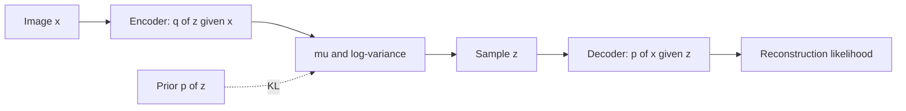

## Variational Autoencoders (VAEs) for image generation

### Motivation

**Generative modeling** asks: learn a distribution $p(\mathbf{x})$ over images (or other data) so that we can **draw new samples** that look like the training set. Applications include **data augmentation**, **creative tools**, **simulation**, and **learning compressed representations** that support smooth interpolation between examples.

A plain **deterministic autoencoder** (Chapter 3, unsupervised learning) maps each image to a single code $\mathbf{z}$. That is excellent for reconstruction and denoising, but **sampling** is awkward: picking a random $\mathbf{z}$ often lands in **“holes”** of the latent space where the decoder was never trained, producing blurry or nonsensical outputs. There is no principled distribution over codes—only a scattered set of training encodings.

**VAEs** treat the latent code as a **random variable**. The encoder outputs a **distribution** $q_\phi(\mathbf{z}\,|\,\mathbf{x})$ instead of one point. Training maximizes a **lower bound** on $\log p(\mathbf{x})$ (the **ELBO**), which (i) keeps reconstructions accurate and (ii) **regularizes** latents toward a simple prior—usually $\mathcal{N}(\mathbf{0}, \mathbf{I})$. After training, **generation** is natural: sample $\mathbf{z} \sim \mathcal{N}(\mathbf{0}, \mathbf{I})$, run the decoder, obtain a new image.

Why it matters:

- **Fast amortized inference**: one forward pass per image to get $q_\phi(\mathbf{z}\,|\,\mathbf{x})$; no iterative MCMC per sample at train time.
- **Smooth latent space**: nearby $\mathbf{z}$ tend to decode to similar images, enabling **interpolation** and light **semantic arithmetic** in $\mathbf{z}$.
- **Foundation for other models**: the same ELBO viewpoint appears in **hierarchical VAEs**, **$\beta$-VAE** (disentanglement trade-offs), and connects conceptually to diffusion and flow objectives.

Intuition: the model assumes each image was produced by **first** sampling a short “idea” vector $\mathbf{z}$ from a simple bowl-shaped prior, **then** rendering pixels with the decoder. Learning aligns **(a)** “ideas that could have produced this image” with **(b)** a shared prior so that **random ideas** decode to plausible images.

```{figure} https://upload.wikimedia.org/wikipedia/commons/7/74/Normal_Distribution_PDF.svg
:width: 55%
:alt: Standard normal probability density

**Prior over latent codes:** VAEs typically use a **standard Gaussian** $p(\mathbf{z}) = \mathcal{N}(\mathbf{0}, \mathbf{I})$. At generation time you sample many $\mathbf{z}$ from this curve (in high dimension: from the multivariate analogue). *Image: Mnmazur, public domain, Wikimedia Commons.*
```

---

### Main idea

**Latent variable model.** Introduce $\mathbf{z}$ and define

$$
p_\theta(\mathbf{x}) = \int p_\theta(\mathbf{x}\,|\,\mathbf{z})\, p(\mathbf{z})\, d\mathbf{z},
$$

with fixed prior $p(\mathbf{z})$ and **decoder** $p_\theta(\mathbf{x}\,|\,\mathbf{z})$ (e.g. Bernoulli or Gaussian pixels). The **true posterior** $p_\theta(\mathbf{z}\,|\,\mathbf{x}) = p_\theta(\mathbf{x}\,|\,\mathbf{z})p(\mathbf{z})/p_\theta(\mathbf{x})$ is **intractable** for rich decoders because $p_\theta(\mathbf{x})$ requires the integral above.

**Variational approximation.** Introduce an **encoder** $q_\phi(\mathbf{z}\,|\,\mathbf{x})$ (another neural net) to approximate that posterior. Instead of maximizing $\log p_\theta(\mathbf{x})$ directly, maximize the **ELBO** (evidence lower bound), which is $\log p_\theta(\mathbf{x}) - D_{\mathrm{KL}}(q_\phi(\mathbf{z}\,|\,\mathbf{x}) \,\|\, p_\theta(\mathbf{z}\,|\,\mathbf{x}))$ and therefore a **lower bound** on $\log p_\theta(\mathbf{x})$.

**Step-by-step (intuition only).** Fix one data point $\mathbf{x}$.

1. **Wish:** high $\log p_\theta(\mathbf{x})$ (good generative model).
2. **Trick:** for *any* density $q_\phi(\mathbf{z}\,|\,\mathbf{x})$, one can show the **ELBO**:

$$
\log p_\theta(\mathbf{x})
\geq
\mathbb{E}_{\mathbf{z}\sim q_\phi}\big[\log p_\theta(\mathbf{x}\,|\,\mathbf{z})\big]
- D_{\mathrm{KL}}\big(q_\phi(\mathbf{z}\,|\,\mathbf{x}) \,\|\, p(\mathbf{z})\big).
$$
3. **First term (reconstruction):** if we sample $\mathbf{z}$ from the encoder and the decoder assigns high likelihood to the real $\mathbf{x}$, the expectation is large. For images, this is often implemented as **negative cross-entropy** or **negative MSE** between $\mathbf{x}$ and the decoder mean.
4. **Second term (KL):** pushes $q_\phi(\mathbf{z}\,|\,\mathbf{x})$ toward the prior so that **the same** prior used at training is **safe to sample from** at generation time.

Maximizing the ELBO thus **jointly** fits the decoder and shapes the encoder so that **$\mathbf{z}$-space is filled** in a way that matches $p(\mathbf{z})$.

**Concrete example (MNIST, conceptual numbers).** Suppose a digit image $\mathbf{x}$ encodes to $q_\phi(\mathbf{z}\,|\,\mathbf{x}) = \mathcal{N}(\boldsymbol{\mu}, \mathrm{diag}(\boldsymbol{\sigma}^2))$ with $\boldsymbol{\mu} \in \mathbb{R}^{16}$. One sample $\mathbf{z}$ might “explain” the stroke width and tilt. The decoder maps that $\mathbf{z}$ to probabilities (or means) over $28\times 28$ pixels. The reconstruction term says: **this $\mathbf{z}$ should make the observed ink likely**. The KL term says: **don’t move $\boldsymbol{\mu}$ far from $\mathbf{0}$ or make $\boldsymbol{\sigma}$ tiny in a hacky way**—keep the distribution close to $\mathcal{N}(\mathbf{0},\mathbf{I})$ so that when we later sample $\mathbf{z}\sim\mathcal{N}(\mathbf{0},\mathbf{I})$ for **unseen** codes, the decoder still sees familiar statistics.

**Mistake to avoid:** turning off or weighting the KL to zero to get pretty reconstructions. You may get **posterior collapse** or a latent space that **does not match** the prior—then **random** $\mathbf{z}$ samples **fail** as generators even if training reconstructions look good.



---

### Architecture

You already saw **convolutional encoder–decoders** in Chapter 3. For image **generation** we keep the same **spatial** pattern; only the **bottleneck** changes.

| Component | Role | Typical output |
|-----------|------|----------------|
| **Encoder** | Amortized inference | Per-image parameters of $q_\phi(\mathbf{z}\,|\,\mathbf{x})$: $\boldsymbol{\mu}_\phi(\mathbf{x})$, $\log \boldsymbol{\sigma}^2_\phi(\mathbf{x})$ (or $\log \boldsymbol{\sigma}_\phi(\mathbf{x})$ for stability) |
| **Sampling** | Stochastic bottleneck | $\mathbf{z} = \boldsymbol{\mu} + \boldsymbol{\sigma} \odot \boldsymbol{\epsilon}$, $\boldsymbol{\epsilon}\sim\mathcal{N}(\mathbf{0},\mathbf{I})$ (**reparameterization trick**) |
| **Decoder** | Likelihood $p_\theta(\mathbf{x}\,|\,\mathbf{z})$ | Means (and optionally variances) of pixels: sigmoid for $[0,1]$ MNIST, or Gaussian means for natural images |

**Reparameterization (why it matters).** We need gradients through **expectation** $\mathbb{E}_{\mathbf{z}\sim q_\phi}[\cdot]$. Sampling $\mathbf{z}$ directly from $\mathcal{N}(\boldsymbol{\mu}, \boldsymbol{\sigma}^2)$ is non-differentiable in $\phi$. Writing $\mathbf{z} = \boldsymbol{\mu} + \boldsymbol{\sigma}\odot\boldsymbol{\epsilon}$ with fixed $\boldsymbol{\epsilon}\sim\mathcal{N}(\mathbf{0},\mathbf{I})$ moves randomness **outside** the path that must differentiate w.r.t. $\boldsymbol{\mu},\boldsymbol{\sigma}$, so **backprop** works.

```mermaid
flowchart TB
  subgraph enc["Encoder (CNN or ViT blocks)"]
    img[Image tensor] --> cnn[Spatial backbone]
    cnn --> flat[Global pool / flatten]
    flat --> fc_mu[Linear -> mu]
    flat --> fc_lv[Linear -> logvar]
  end
  subgraph bottleneck["Latent (dim d)"]
    fc_mu --> mu[mu]
    fc_lv --> lv[logvar]
    mu --> rep["z = mu + sigma * epsilon"]
    lv --> rep
    noise[epsilon ~ N(0,I)] --> rep
  end
  subgraph dec["Decoder (mirror CNN)"]
    rep --> reshape[Project + reshape]
    reshape --> up[ConvTranspose / upsample]
    up --> out[Pixel means + activation]
  end
```

**Decoder likelihood choices:**

- **Bernoulli** (logits + sigmoid): common for **binary / bounded** MNIST in $[0,1]$.
- **Gaussian** with fixed variance: reconstruction term becomes **scaled MSE**.
- **Diagonal Gaussian** with learned variance: more flexible, slightly heavier.

This chapter focuses on **using** the trained decoder as a **generator**; architectural details match standard practice in Chapter 3 with the Gaussian bottleneck above.

---

### Training

**Objective (single sample Monte Carlo per $\mathbf{x}$).** For each training image:

1. Forward encoder: $\boldsymbol{\mu}, \log\boldsymbol{\sigma}^2 = f_\phi(\mathbf{x})$.
2. Sample $\boldsymbol{\epsilon}\sim\mathcal{N}(\mathbf{0},\mathbf{I})$, set $\mathbf{z} = \boldsymbol{\mu} + \boldsymbol{\sigma}\odot\boldsymbol{\epsilon}$ with $\boldsymbol{\sigma} = \exp(\tfrac{1}{2}\log\boldsymbol{\sigma}^2)$.
3. Forward decoder: $\hat{\mathbf{x}} = g_\theta(\mathbf{z})$ (or logits).
4. **Loss** $= -\log p_\theta(\mathbf{x}\,|\,\mathbf{z}) + D_{\mathrm{KL}}(q_\phi(\mathbf{z}\,|\,\mathbf{x}) \,\|\, p(\mathbf{z}))$ (or **maximize** ELBO if you flip signs in code).

**KL for diagonal Gaussians** (prior $\mathcal{N}(\mathbf{0},\mathbf{I})$), per latent dimension $j$:

$$
D_{\mathrm{KL}}\big(\mathcal{N}(\mu_j,\sigma_j^2)\,\|\,\mathcal{N}(0,1)\big)
= \tfrac{1}{2}\big(\sigma_j^2 + \mu_j^2 - 1 - \log \sigma_j^2\big).
$$

Sum over $j$ for the full vector. In code, **clamp** $\log\boldsymbol{\sigma}^2$ or use **softplus** for scale to avoid numerical blow-ups.

**Practical balance ($\beta$-VAE).** Some work uses

$$
\mathcal{L} = -\mathbb{E}_{q_\phi}[\log p_\theta(\mathbf{x}\,|\,\mathbf{z})] + \beta\, D_{\mathrm{KL}}(q_\phi\,\|\,p),
$$

with $\beta \neq 1$: larger $\beta$ → **more regular** latent space (often blurrier samples); smaller $\beta$ → **sharper** reconstructions but riskier **sampling**. For teaching, start with $\beta=1$ (standard VAE), then sweep $\beta$ in a lab.

**Optimization:** Adam, learning rates around $10^{-3}$ to $10^{-4}$ for conv VAEs on small images; **anneal** KL weight from $0$ to $1$ over first epochs if training is unstable (KL vanishing or exploding).

---

### Generation

After training:

1. **Unconditional sample:** draw $\mathbf{z} \sim \mathcal{N}(\mathbf{0}, \mathbf{I})$, compute $\hat{\mathbf{x}} = g_\theta(\mathbf{z})$ (apply sigmoid if using Bernoulli means). Repeat for a batch of independent $\mathbf{z}$’s.
2. **Interpolation:** encode two real images to **means** $\boldsymbol{\mu}^{(1)}, \boldsymbol{\mu}^{(2)}$ (or sample two $\mathbf{z}$’s), take $\mathbf{z}(\alpha) = (1-\alpha)\boldsymbol{\mu}^{(1)} + \alpha\boldsymbol{\mu}^{(2)}$ for $\alpha\in[0,1]$, decode each $\mathbf{z}(\alpha)$—you get a **morph** in image space.
3. **Conditional extensions (reading):** **conditional VAEs** concatenate a label or embedding to $\mathbf{z}$ or to intermediate features so that generation can follow class or attributes.

**What to expect qualitatively:** VAE samples are often **softer** than GAN or diffusion samples: optimizing a **likelihood bound** with a Gaussian latent and simple decoder tends to **average** modes (some blur). That is a feature of the objective, not necessarily a bug for teaching **probabilistic** generation.

---

### Math formulation summary

**ELBO** for one example $\mathbf{x}$:

$$
\mathcal{L}_{\mathrm{ELBO}}(\theta,\phi;\mathbf{x})
=
\mathbb{E}_{\mathbf{z}\sim q_\phi(\mathbf{z}\,|\,\mathbf{x})}\big[\log p_\theta(\mathbf{x}\,|\,\mathbf{z})\big]
-
D_{\mathrm{KL}}\big(q_\phi(\mathbf{z}\,|\,\mathbf{x})\,\|\,p(\mathbf{z})\big).
$$

**Training** maximizes $\mathbb{E}_{\mathbf{x}\sim p_{\mathrm{data}}}[\mathcal{L}_{\mathrm{ELBO}}]$ (equivalently minimizes negative ELBO). **Generation** uses $p(\mathbf{z})$ and $p_\theta(\mathbf{x}\,|\,\mathbf{z})$ only.

---

### Starter sketch (reparameterization + KL)

Minimal pieces to add on top of a conv encoder–decoder (see Chapter 3 for full spatial stacks):

```python
import math
import torch
import torch.nn as nn
import torch.nn.functional as F


def reparameterize(mu: torch.Tensor, logvar: torch.Tensor) -> torch.Tensor:
    """mu, logvar: (B, D); returns z ~ N(mu, exp(logvar))."""
    std = torch.exp(0.5 * logvar)
    eps = torch.randn_like(std)
    return mu + eps * std


def kl_diag_gaussian(mu: torch.Tensor, logvar: torch.Tensor) -> torch.Tensor:
    """KL( N(mu, diag(exp logvar)) || N(0,I) ), shape (B,) per row then mean."""
    # 0.5 * sum( exp(logvar) + mu^2 - 1 - logvar )
    return 0.5 * torch.sum(torch.exp(logvar) + mu.pow(2) - 1.0 - logvar, dim=1)


def vae_loss(x: torch.Tensor, x_logits: torch.Tensor, mu: torch.Tensor, logvar: torch.Tensor) -> torch.Tensor:
    """x in [0,1]; x_logits are decoder logits before sigmoid (Bernoulli log-likelihood)."""
    recon = F.binary_cross_entropy_with_logits(x_logits, x, reduction="none").view(x.size(0), -1).sum(dim=1)
    kl = kl_diag_gaussian(mu, logvar)
    return (recon + kl).mean()
```

Suggested student exercises:

1. Train a small conv VAE on **MNIST** with `latent_dim=2`; plot encoder means colored by digit, then **sample** 16 $\mathbf{z}\sim\mathcal{N}(\mathbf{0},\mathbf{I})$ and show a $4\times 4$ gallery of decoded digits.
2. Implement **linear interpolation** between two test images in **$\boldsymbol{\mu}$-space** and save an animated GIF of decoded frames.
3. Sweep **$\beta$** in $\beta$-VAE; report **FID** or simple **sample sharpness** vs. **KL** to the prior (mean $D_{\mathrm{KL}}$ per batch).
4. Ablate the **reparameterization trick** (stop gradients through $\boldsymbol{\sigma}$ incorrectly) and show that encoder variance collapses or training becomes unstable.
